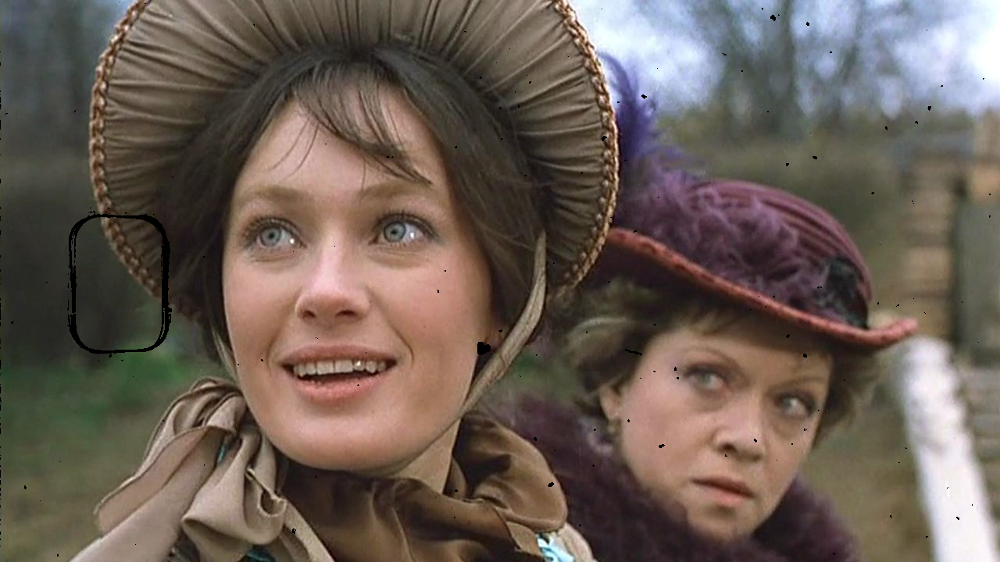

# Old Film Scratch Detection (WIP)

The main task of the repository is to detect scratches, VHS effects, etc.

# Datasets

Скачать набор данных

```shell
bash download_data.sh
```

Разделение видео на кадры

```shell
python split_video_by_frame.py --video data/video_original/film_1.mp4 --frame 5 --prefix film_one
```

Создание набора данных

```shell
python run_generator.py --original_folder data/images --masks_folder data/masks --defects_folder data/defects --video_defects_folder data/video_defects
```

# Example



